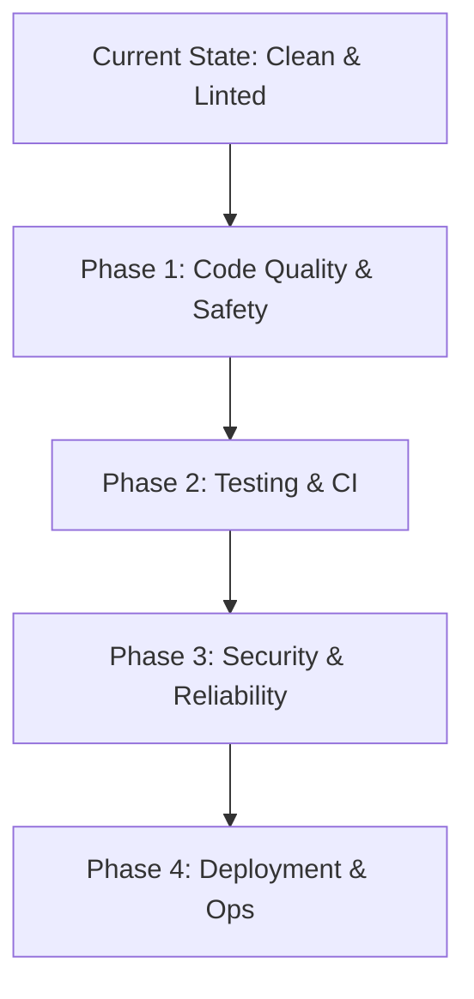

# Compass Production Readiness Guide

This guide serves as our strategic reference and standards blueprint for transitioning Compass into a commercial-grade, secure, and resilient application. Use this document as a checklist and architectural guide when refactoring or adding new features.

---

## Production Readiness Roadmap

To avoid **analysis paralysis** and ensure we build things incrementally, we have organized our production-ready goals into four sequential phases.

### Phase 1: Code Quality & Safety (The Foundation)

Focuses on local development guardrails. Prevents bad data from entering Mongoose, and stops bad commits from being pushed.

- **[x] TypeScript Migration (complete):** Static typing across server and client, both packages on native ESM. Full writeup in [typescript-migration.md](./typescript-migration.md). See [Section 6](#6-dev-workflow--professionalism).
- **[ ] Request Validation (Zod):** Validate inputs at the Express route boundary. See [Section 1](#1-backend--reliability).
- **[ ] Pre-commit Hooks (Husky & lint-staged):** Prevent pushing code that fails linting or formatting. See [Section 6](#6-dev-workflow--professionalism).
- **[ ] Clean Commit Messages:** Adopt Conventional Commits format (`feat:`, `fix:`). See [Section 6](#6-dev-workflow--professionalism).

### Phase 2: Testing & CI (Confidence)

Focuses on proving that our changes don't break existing features automatically.

- **[x] Backend Route Testing (Vitest + Supertest):** Integration tests for Habit and Task APIs covering happy and sad paths. See [Section 4](#4-testing-suite).
- **[x] GitHub Actions CI:** Lint, typecheck, test, and build run in the cloud on every pull request and push to `main`. See [Section 6](#6-dev-workflow--professionalism).
- **[ ] Data Integrity Tests:** Test database validation constraints in an isolated test environment. See [Section 2](#2-database--data-integrity).

### Phase 3: Security & Reliability (The Shield)

Focuses on protecting the application on the public internet before we share it.

- **[ ] Security Headers & CORS (Helmet):** Prevent unauthorized sites from accessing our API and secure browser outputs. See [Section 5](#5-security-standards).
- **[ ] Rate Limiting (`express-rate-limit`):** Prevent brute-force spamming. See [Section 1](#1-backend--reliability).
- **[ ] Structured Logging (Winston/Pino):** Write server logs in queryable JSON format. See [Section 1](#1-backend--reliability).
- **[ ] Input Sanitization:** Prevent NoSQL injection. See [Section 1](#1-backend--reliability).

### Phase 4: Deployment & DevOps (The Launch)

Focuses on moving from local execution to standard production environments.

- **[ ] Multi-Stage Production Dockerfiles:** Optimize frontend asset compilation and backend startup sizes. See [Section 7](#7-deployment--ops).
- **[ ] Environment Variable Management:** Securely inject production secrets into containers. See [Section 7](#7-deployment--ops).
- **[ ] Database Indexing & Pagination:** Make queries scale-proof. See [Section 2](#2-database--data-integrity).

---

## 1. Backend & Reliability

### Request Validation

- **Concept:** Rejecting malformed HTTP requests before they trigger controller logic or hit the database.
- **Compass Application:** Install **Zod** to validate request bodies and query parameters (e.g., verifying `req.body.name` is a non-empty string during habit creation).
- **Why it matters:** Prevents corrupt data insertions and shields the database from crash-inducing inputs.

### Centralized Error Handling

- **Concept:** Funneling all route errors into a single Express error-handling middleware instead of catching and handling them ad-hoc in every controller.
- **Compass Application:** Write a `server/src/middleware/errorHandler.ts` containing `(err, req, res, next) => { ... }`.
- **Why it matters:** Guarantees that clients always receive consistent JSON error responses, prevents database stack traces from leaking to the client, and simplifies logging.

### Structured Logging

- **Concept:** Emitting logs as queryable JSON payloads containing metadata (timestamps, request IDs, log levels) instead of plain-text console lines.
- **Compass Application:** Install **Winston** or **Pino** to format logs.
- **Why it matters:** Critical for parsing and searching logs using dashboard tools in production host environments (e.g., Datadog, Papertrail).

### Input Sanitization & Security Hardening

- **Concept:** Stripping database commands or executable code from user strings.
- **Compass Application:** Use middleware like `express-mongo-sanitize` to prevent NoSQL injection attacks (where a user inputs a query object like `{"$gt": ""}` instead of a string to bypass authentication).

### Graceful Async Handling

- **Concept:** Ensuring the server catches unhandled promise rejections and closes connections cleanly before shutting down during a crash.
- **Compass Application:** Capture `process.on('unhandledRejection')` and gracefully shut down the Express server and MongoDB connection.

---

## 2. Database & Data Integrity

### Intentional Indexing

- **Concept:** Telling the database engine to maintain lookup tables for fields that are queried frequently.
- **Compass Application:** Define indexes in Mongoose schemas for fields queried in lookup clauses (e.g., indexing `HabitLog` on `date` and `habitId`).
- **Why it matters:** Prevents slow "collection scans" that scan every document in the database, keeping queries fast as data scales.

### Schema-Layer Validation

- **Concept:** Enforcing field types, ranges, and required conditions at the database model level.
- **Compass Application:** Use Mongoose schema validation constraints (e.g. `min`/`max` values on streak integers).
- **Why it matters:** Acts as the final line of defense for data consistency if backend validations are bypassed.

### Migration Strategy

- **Concept:** Managing database structure changes (schema changes) programmatically over time.
- **Compass Application:** Add a tool like `migrate-mongo` to write run-up/run-down migration scripts (e.g. when transitioning habits from binary types to progressive types in V3).

### Pagination for Large Datasets

- **Concept:** Returning data in chunks (pages) rather than loading thousands of records at once.
- **Compass Application:** Add `limit` and `skip` (or cursor-based parameters) to routes that return historical reflection logs or task histories.

---

## 3. Frontend & UX Engineering

### Optimistic UI & Error Rollback

- **Concept:** Updating the screen instantly on user click and handling the server sync silently in the background.
- **Compass Application:** Implemented on the habit toggle checkbox. If the backend fails, the checkbox state is automatically rolled back.
- **Why it matters:** Removes network latency from the user experience, making interactions feel instant.

### Component Abstraction & Reusable Hooks

- **Concept:** Extracting business logic from presentational components into custom React hooks (e.g., `useHabits`).
- **Compass Application:** Moving data loading and state manipulation out of `HabitsPage.tsx` into hooks.

### Accessibility (a11y)

- **Concept:** Ensuring users can navigate the interface with screen readers or keyboard navigation.
- **Compass Application:** Adding appropriate ARIA attributes, semantic HTML elements, and keyboard focus states to custom checkbox inputs and modals.

---

## 4. Testing Suite

### Unit & Integration Testing

- **Concept:** Programmatically verifying small blocks of logic in isolation (unit) and database/route integrations (integration).
- **Status: ✅ Implemented.** Vitest and Supertest are installed and configured with:
  - `server/tests/setup.ts` — Connects to the isolated `compass_test` database before all tests. Clears all collections before each individual test to ensure a clean state. Disconnects cleanly after all tests.
  - `server/vitest.config.ts` — Configures the setup file, enables Vitest globals (`describe`, `it`, `expect`), and disables file parallelism (all test files share the `compass_test` database, so parallel runs would wipe each other's data).
  - `server/tests/health.test.ts` — Verifies the health check endpoint returns 200.
  - `server/tests/habits.test.ts` — Full happy & sad path coverage for all 7 Habits API endpoints, including streak logic, soft delete, orphaned log prevention, and duplicate log conflict detection.
  - `server/tests/tasks.test.ts` — Full happy & sad path coverage for all 6 Tasks API endpoints, verifying complete/uncomplete actions, hard-delete permanence, and ID format validation.
  - These 42 tests run automatically in CI against a MongoDB service container. See [Section 6](#6-dev-workflow--professionalism).

### End-to-End (E2E) Testing

- **Concept:** Controlling a virtual browser to simulate complete user flows.
- **Compass Application:** Use **Playwright** or **Cypress** to test that clicking a checkbox successfully increments a habit streak.

---

## 5. Security Standards

### Password Hashing Best Practices

- **Concept:** Never storing raw user passwords in the database.
- **Compass Application:** Use **bcrypt** (or Argon2) to salt and hash passwords during user registration and authentication.

### Secure Headers & CORS

- **Concept:** Hardening the HTTP header response to prevent browsers from executing untrusted scripts.
- **Compass Application:** Install **Helmet** in Express and configure strict **CORS** parameters to prevent unauthorized websites from querying your API.

---

## 6. Dev Workflow & Professionalism

### TypeScript Conversion

- **Concept:** Enforcing static typing at compile-time to prevent runtime type errors.
- **Status: ✅ Complete.** Every server and client source file is TypeScript, and both packages run on native ESM. Full toolchain explanation and TS concepts introduced: [typescript-migration.md](./typescript-migration.md).
- **Why it matters:** Catches object mapping errors and property typo bugs before running the app.

### Pre-commit Hooks (Husky)

- **Concept:** Running linters and formatters automatically during code stage check-ins.
- **Compass Application:** Set up Husky to block `git commit` actions if ESLint checks fail. Keep the hook fast (lint-staged on changed files only); leave the full typecheck and test suite to CI.

### GitHub Actions CI

- **Concept:** Setting up a cloud pipeline to verify every commit pushed to remote repositories.
- **Status: ✅ Implemented.** [`.github/workflows/ci.yml`](../.github/workflows/ci.yml) runs on every pull request and on pushes to `main`, as two parallel jobs:
  1. **`server`** — `npm run typecheck` (`tsc --noEmit`), `npm run lint`, `npm test` against a `mongodb:8.2.3` **service container** (points `DB_TEST_URI` at it since there's no local Docker instance in the cloud), then `npm run build` to confirm the `dist/` build compiles.
  2. **`client`** — `npm run typecheck` (`tsc -b`), `npm run lint`, `npm run build` (Vite build, with `tsc -b` running first so a type error fails the build).
- **Why it matters:** `tsx` and Vitest only *strip* types to run code fast, they never *validate* them, so `typecheck` in CI is what actually catches type errors — local discipline (manual test runs) is opt-in, CI is the enforced safety net on every push.

---

## 7. Deployment & DevOps

### Multi-Stage Docker Build

- **Concept:** Writing optimized Dockerfiles to compile production-ready assets while leaving heavy build tools behind.
- **Compass Application:** Build Vite assets in a node environment container, copy them to a lightweight Nginx server container, and deploy the Express API separately.

### Compiled TypeScript in Production

- **Concept:** Production servers should run plain compiled JavaScript, not transpile TypeScript on the fly.
- **Compass Application:** Done — `npm run build` compiles via `tsconfig.build.json` into `dist/`, and `npm start` runs `node dist/server.js`. In Docker terms, `tsc` runs in the build stage and only `dist/` ships in the final image.
- **Why it matters:** Faster cold starts, no dev-tooling dependency in the production image, and the build step doubles as a final full typecheck before release.

### Health Checks

- **Concept:** Providing a lightweight ping route for servers to verify if the server is healthy.
- **Compass Application:** The `/api/health` route is used by hosting providers (like Railway or AWS) to test if the container started successfully before routing live traffic to it.
